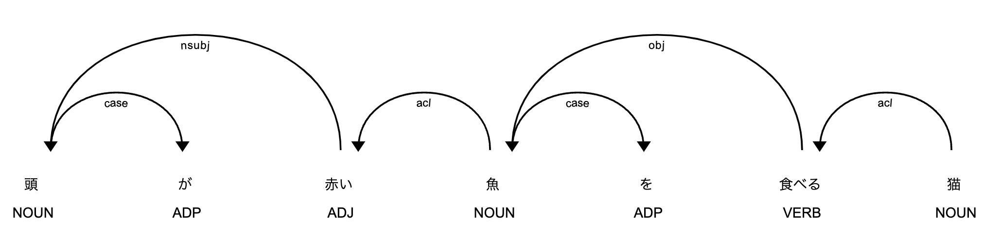
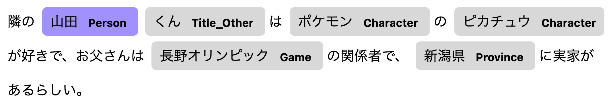

ginza
===

Get started to using spaCy with Japanese NLP Library GiNZA.

- [ginza](#ginza)
  - [Installation](#installation)
  - [Usage](#usage)
    - [Simple tokenize.](#simple-tokenize)
    - [Split text to tokens with some rules.](#split-text-to-tokens-with-some-rules)
    - [Split text to sentences and *bunsetu*.](#split-text-to-sentences-and-bunsetu)
    - [Render tokens dependencies.](#render-tokens-dependencies)
    - [Render NER (Named Entity Recognition) of sentence.](#render-ner-named-entity-recognition-of-sentence)

## Installation

```bash
python3 -m venv .venv \
&& source .venv/bin/activate \
&& pip install pip --upgrade \
&& pip install -r requirements.lock
```

## Usage

### Simple tokenize.

```bash
ginza ❯ python src/simple_tokenize.py "私はソフトウェアエンジニアです"

私
は
ソフトウェア
エンジニア
です
```

### Split text to tokens with some rules.

```bash
ginza ❯ python src/split_to_tokens.py '私は国家公務員と銀座にご飯を食べに行きます。'  
---- SplitMode: A ----
text    tag     pos     lemma
私      代名詞  PRON    私
は      助詞-係助詞     ADP     は
国家    名詞-普通名詞-一般      NOUN    国家
公務    名詞-普通名詞-一般      NOUN    公務
員      接尾辞-名詞的-一般      NOUN    員
と      助詞-格助詞     ADP     と
銀座    名詞-固有名詞-地名-一般 PROPN   銀座
に      助詞-格助詞     ADP     に
ご飯    名詞-普通名詞-一般      NOUN    ご飯
を      助詞-格助詞     ADP     を
食べ    動詞-一般       VERB    食べる
に      助詞-格助詞     ADP     に
行き    動詞-非自立可能 VERB    行く
ます    助動詞  AUX     ます
。      補助記号-句点   PUNCT   。

---- SplitMode: B ----
text    tag     pos     lemma
私      代名詞  PRON    私
は      助詞-係助詞     ADP     は
国家    名詞-普通名詞-一般      NOUN    国家
公務員  名詞-普通名詞-一般      NOUN    公務員
と      助詞-格助詞     ADP     と
銀座    名詞-固有名詞-地名-一般 PROPN   銀座
に      助詞-格助詞     ADP     に
ご飯    名詞-普通名詞-一般      NOUN    ご飯
を      助詞-格助詞     ADP     を
食べ    動詞-一般       VERB    食べる
に      助詞-格助詞     ADP     に
行き    動詞-非自立可能 VERB    行く
ます    助動詞  AUX     ます
。      補助記号-句点   PUNCT   。

---- SplitMode: C ----
text    tag     pos     lemma
私      代名詞  PRON    私
は      助詞-係助詞     ADP     は
国家公務員      名詞-普通名詞-一般      NOUN    国家公務員
と      助詞-格助詞     ADP     と
銀座    名詞-固有名詞-地名-一般 PROPN   銀座
に      助詞-格助詞     ADP     に
ご飯    名詞-普通名詞-一般      NOUN    ご飯
を      助詞-格助詞     ADP     を
食べ    動詞-一般       VERB    食べる
に      助詞-格助詞     ADP     に
行き    動詞-非自立可能 VERB    行く
ます    助動詞  AUX     ます
。      補助記号-句点   PUNCT   。
```

### Split text to sentences and *bunsetu*.

```bash
ginza ❯ python src/split_to_sentences.py '私は国家公務員です。銀座でご飯を食べます。好きなお店は秘密です。'
私は国家公務員です。
        '私は' 
                '私' 'は' 
        '国家公務員です。' 
                '国家公務員' 'です' '。' 
銀座でご飯を食べます。
        '銀座で' 
                '銀座' 'で' 
        'ご飯を' 
                'ご飯' 'を' 
        '食べます。' 
                '食べ' 'ます' '。' 
好きなお店は秘密です。
        '好きな' 
                '好き' 'な' 
        'お店は' 
                'お店' 'は' 
        '秘密です。' 
                '秘密' 'です' '。'
```

### Render tokens dependencies.

```bash
ginza ❯ python src/show_token_dependencies.py '頭が赤い魚を食べる猫' 
```



### Render NER (Named Entity Recognition) of sentence.

```bash
ginza ❯ python src/show_entities.py '隣の山田くんはポケモンのピカチュウが好きで、お父さんは長野オリンピックの関係者で、新潟県に実家があるらしい。'
text    label   start   end
山田    Person  2       4
くん    Title_Other     4       6
ポケモン        Character       7       11
ピカチュウ      Character       12      17
長野オリンピック        Game    27      35
新潟県  Province        41      44
```

